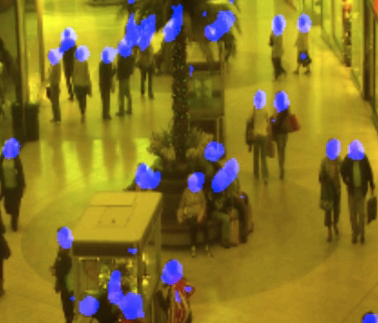

# object-locator
Tensorflow implementation for Weighted Hausdorff Distance: A Loss Function For Object Localization https://arxiv.org/abs/1806.07564


# Installation
```
conda env create -f environment.yml

```
# Training
```
conda activate object-locator
python train.py
```
to monitor the training process, by default the summary dir is set to $args.output_dir/summary
```
tensorboard --logdir training_checkpoints/summary/
```
output sample:


